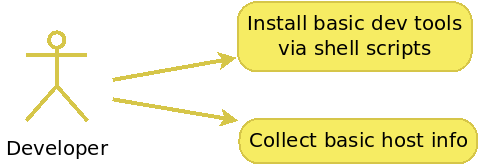

    

# Intro
Collection of scrips to install/uninstall main dev tools like node.js, all docker stuff, Ansible, Vagrant etc.
So I can forget Googling and simply install everything from command line.

---

# Prerequisites
* Ubuntu 20.04

---

# Use-cases
* As a developer I wish to have a set of scripts to install some most-common dev tools. Simply want to skip googling and save my time.
* As a developer I wish to collect basic host info like kernel version, some packages, etc.

    

---

# Tools set
 * tool for hollecting basic host info
     * sysinfo.sh
 * basic tools
     * vim
     * git
     * tig
     * mc
     * some other tools as well
 * Vagrant
 * Ansible
 * docker
 * docker-compose
 * node.js

